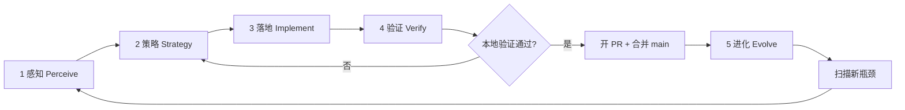

# AGENTS.md

Guidance for AI coding agents working in this repository.

## Project overview

**LLMIR** is an MLIR-based compiler and Python runtime for optimizing LLM inference. The primary development surface is the **`llmir` Python package** in `src/llmir/`. The repo also vendors a full MLIR tree and a custom LLM dialect under `include/mlir/Dialect/LLM/` and `lib/Dialect/LLM/`.

> 原 `Agent.md` 已并入本文件。Cloud Agent 与人类协作者均将本文当作**活文档**；每轮验证通过后更新「当前轮次笔记」或 Gotchas。

---

## LLMIR 无限优化闭环（Infinite Optimization Loop）

本仓库的持续改进**没有终止条件**。每一轮闭环的目标不是「做完就停」，而是：

**感知现状 → 选定瓶颈 → 最小落地 → 用证据验证 → 写回文档与契约 → 合并 main → 扫描 backlog → 下一轮**

**不要**为此闭环新增独立编排脚本（例如一键跑完全部阶段的 orchestrator），除非用户明确要求。闭环由 Agent 按层执行现有 `pytest`、E1–E6 脚本与 git/PR 工具，并把经验沉淀进文档。

### 核心原则

| 原则 | 含义 |
|------|------|
| **先测后优** | 没有基准与正确性证据，不改 Pass、KV backend 或论文主张 |
| **主张 ≤ 证据** | `CAPABILITY_MATRIX` 为上限；Planned 不得写进主文摘要 |
| **A/B 分类** | **A 类**（Pass/组合/parity）可 CI 闭合；**B 类**（7B vs vLLM）仅 E8 可选实测 |
| **瓶颈驱动** | 优先修契约缺口、静默错误、论文 traceability 断裂，再追求微基准 |
| **最小改动** | 每轮只解决本轮策略选定的 1～2 个瓶颈，避免无关重构 |
| **验证通过再沉淀** | pytest + bench JSON 通过后再更新 matrix、traceability、`AGENTS.md` |
| **编译器对齐** | 借鉴 PyTorch/TVM 分工：重计算走成熟 runtime（HF/vLLM）；LLMIR 价值在 **IR 级 block/prefix/KV 静态分析**，不在重造 FlashAttention 微内核 |

### 执行前闸门：框架目标与优化价值（每轮必做）

**在勾选检查清单第 2 步「策略」、写代码之前**，Agent 必须先完成本闸门；若结论为「价值不足」，改选 backlog 中更高优先级项。

#### LLMIR 框架目标（编译 + serving 分工）

| 层级 | 业界参考 | LLMIR 对应 |
|------|----------|------------|
| **原语 / runtime** | ATen、FlashAttention、vLLM CUDA kernels | HF forward + `llmir_paged`；`numpy` / `torch_cuda` / `native` KV |
| **编译 / IR** | XLA Grappler、Torch-MLIR passes | `llm-optimize-kv-cache`、block size、KV dialect、lowering |
| **Serving 代理** | vLLM prefix cache、TTFT | E2 shared-prefix decoder、`PrefixKVStore` |
| **验证** | 数值对齐 + 图等价 | E1 reference、E6 backend parity、lit、`ProbabilisticVerifier` 等价路径 |

**借鉴要点（非照搬）**：

- **IR 上浮、kernel 下沉**：主文不 claim 算子级 beat FlashAttention；算子图放 `benchmark/attention/` 附录并标 *future work*。
- **同 harness 评判**：E6 parity、MVP-C bench 须在**同一模型、同一 greedy 路径**上比较 backend，不把跨后端数字混进 A 类定理表述。
- **正确性优先于吞吐**：先 E1/E6 正确性，再 MVP-C 性能面板（B 类口吻）。

#### 四轮自问（策略卡片必填）

在 PR 描述或本轮笔记中用 **1～2 句话**回答：

1. **层级**：本轮改的是 IR/Pass、serving 集成，还是论文/traceability？若仅为孤立 attention 微基准 → **拒绝或降级**。
2. **证据档**：属于 **A 类（E1–E6）** 还是 **B 类（E8）**？B 类未实测不得进摘要。
3. **收益**：正确性、可复现 harness、组合上界、还是实验室吞吐？性能向须写明对照命令（如 `llmir-benchmark --mvp-c-bench`）。
4. **机会成本**：是否还有更高优先级项（失败测试、matrix Planned 被写进论文、E4–E6 缺口）？

### 五层结构



#### 第 1 层：感知（Perceive）— 我们在哪？

**目标**：弄清能力边界、E1–E6 覆盖、论文主张与仓库是否一致、下一里程碑缺口。

**权威锚点（改论文前必读）**：

| 文档 | 用途 |
|------|------|
| [`docs/CAPABILITY_MATRIX.md`](docs/CAPABILITY_MATRIX.md) | 实现程度（C++ / Python ref / Planned） |
| [`docs/PAPER_REVISION_TRACEABILITY.md`](docs/PAPER_REVISION_TRACEABILITY.md) | 论文主张 ↔ E1–E6、JSON、pytest |
| [`docs/PAPER_TOP_TIER_BAR.md`](docs/PAPER_TOP_TIER_BAR.md) | Tier-A 差距与里程碑 |
| [`docs/DECODER_WORKLOAD_ARCHITECTURES.md`](docs/DECODER_WORKLOAD_ARCHITECTURES.md) | Qwen / 开源 Gemma / DeepSeek；S1/S2/S3 |
| [`IEEE-conference/REVISION_NOTES.md`](IEEE-conference/REVISION_NOTES.md) | 审稿映射与诚实边界 |

**典型命令**：

```bash
export PATH="$HOME/.local/bin:$PATH"
pytest tests/ -m "not network" -q
pytest tests/test_mvp_a_e2e.py tests/test_mvp_c_e2e.py tests/test_sharegpt_prefix_bench.py \
  tests/test_e4_compositional.py tests/test_e5_ablation.py tests/test_e6_backend_parity.py \
  tests/test_m5_lowered_hot_path.py -m "not network" -q
bash scripts/reproduce_paper.sh   # 或分步跑 E1–E6
```

**产出**：简短「现状快照」— 失败测试、CAPABILITY_MATRIX 中 Planned 但被论文引用项、未闭合 E 档、traceability 缺口。

---

#### 第 2 层：策略（Strategy）— 下一步改什么？

**前置**：已完成上文「执行前闸门」四轮自问。

| 信号 | 优先策略 |
|------|----------|
| pytest / lit 失败 | 修正确性；不叠加新实验 |
| 论文写了但无 harness | 补 E 档脚本 + traceability，或收窄论文表述 |
| E4–E6 缺口 | 按里程碑 Mx 补组合/消融/parity（A 类） |
| hot path 仍走 HF 绕开 lowered op | M5：lowered kernel 上路径（完整性） |
| 用户要「比 vLLM 快」 | 转 E4 组合论证；或 E8 实测；**不得**伪造 A 类定理 |
| 算子微基准诱人 | 仅附录 future work；不进主文 |

**工程里程碑（Loop 1 牵引 Loop 2）**：

```
M1  E1 单层 IR + CI                 [done]
M2  E4 trace 组合验证               [done]
M3  E5 消融开关                     [done]
M4  E6 多后端 parity                [done]
M5  Lowered op hot path             [done]
M6  Artifact 包（CPU 可复现 E1–E6） [done]
M7  E8 GPU 实测（可选）
```

**产出**：策略卡片 — 1 句话目标、触及文件、预期验证命令（写入 PR 即可）。

---

#### 第 3 层：落地（Implement）— 最小正确实现

**常见落地点**：

| 领域 | 路径 |
|------|------|
| MLIR Pass / dialect | `lib/Dialect/LLM/`, `test/Dialect/LLM/` |
| Python 编译器 / reference | `src/llmir/compiler/` |
| Serving / KV | `src/llmir/runtime/`, `src/llmir/serving/` |
| 实验 harness | `src/llmir/benchmark/`, `scripts/e*_*.py`, `tests/test_e*_*.py` |
| 论文 | `IEEE-conference/`, `docs/E*_*.md` |

**禁止**：为「跑闭环」新建 `llmir_optimization_loop.py` 类编排器；用 `reproduce_paper.sh` 串联**已有**脚本即可。

**优先级**：**P0 正确性** → **P1 主文 A 类证据链** → **P2 性能** → **P3 生态**。

---

#### 第 4 层：验证（Verify）— 证据链

**A 类最小验证集（收工前必跑）**：

```bash
pytest tests/test_mvp_a_e2e.py tests/test_mvp_c_e2e.py tests/test_sharegpt_prefix_bench.py \
  tests/test_e4_compositional.py tests/test_e5_ablation.py tests/test_e6_backend_parity.py \
  tests/test_m5_lowered_hot_path.py -m "not network" -q
python3 scripts/e4_compositional_verify.py --from-sim \
  IEEE-conference/benchmarks/shared_prefix_decoder_2048_sim.json
python3 scripts/e5_ablation_verify.py --from-sim \
  IEEE-conference/benchmarks/shared_prefix_decoder_2048_sim.json
python3 scripts/e6_backend_parity_verify.py --model toy
python3 scripts/m5_lowered_hot_path_verify.py
python3 scripts/verify_artifact_bundle.py --skip-figures
python3 -c "
import json; from pathlib import Path
p=json.loads(Path('IEEE-conference/benchmarks/paper_results.json').read_text())
assert 'e1' in p; assert Path(p['e1']['mlir_snippet_path']).is_file()
print('paper_results OK')
"
python3 IEEE-conference/figures/generate_all_nature_figures.py
```

**Definition of Done**：traceability 可核对；主文无未标注的 operator/多卡 measured 口吻；图由脚本生成；E1–E6 命名统一。

**合并闸门**：仅当本节最小验证集在本机 **exit 0** 后，Agent 才可合并 PR（不得以无关 CI 红为借口跳过本地验证）。

---

#### 第 5 层：进化（Evolve）— 写回知识，开启下一轮

**必须更新（按影响面）**：

1. **`AGENTS.md`** — 「当前轮次笔记」或 Gotchas
2. **`docs/PAPER_REVISION_TRACEABILITY.md`** — 新 E 档 / JSON
3. **`docs/CAPABILITY_MATRIX.md`** — 状态从 Planned → Implemented 时
4. **`IEEE-conference/REVISION_NOTES.md`** — 论文主张变更时
5. **集成测试** — 新 harness 须有 `tests/test_*.py`

**本轮结束写清**：瓶颈 → 策略 → 改动 → 验证结果 → **下一轮建议**。

---

### Cloud Agent 自主连续迭代协议

用户未明确喊停时，Cloud Agent **默认连续跑多轮 Loop**：感知 → 策略 → 落地 → 验证 → **自动合并** → 进化 → 扫描 backlog → 回到感知。

仍**禁止**新建独立 orchestrator；由 Agent 按检查清单手工串联。

#### 验证通过后的自动合并

满足**全部**条件时，Agent **必须**自行合并 PR（无需再等用户说 merge）：

| 条件 | 要求 |
|------|------|
| 本地验证 | 第 4 层 A 类最小验证集 exit 0（或本轮触及的后端等价命令） |
| 分支规范 | `cursor/<descriptive-name>-575e`，已 push，`base_branch=main` |
| PR 状态 | `mergeable`；若仍为 draft，先 `gh pr ready` |
| 合并方式 | `gh pr merge <n> --squash --delete-branch`（与仓库惯例一致即可） |
| 合并后 | `git checkout main && git pull origin main`，再开下一轮分支 |

**不自动合并**：本地验证失败；合并冲突需人工决策；用户明确「先别合并」「只写文档」。

**关于 GitHub Actions**：`main` 上可能存在与本轮无关的 CI 失败（lint、Python 3.8 等）。**以本地 Loop 验证集为准**；合并后在 PR / 轮次笔记中注明 CI 状态。

#### 合并后扫描「下一轮 backlog」

```bash
git checkout main && git pull origin main
pytest tests/ -m "not network" -q
# 对照 CAPABILITY_MATRIX、PAPER_TOP_TIER_BAR 里程碑
```

**候选问题优先级**：

1. 失败测试 / parity 不一致 / `NotImplementedError` on hot path
2. 论文 traceability 断裂（主张无 JSON/pytest）
3. CAPABILITY_MATRIX **Planned** 但被主文引用
4. 未完成的 M5/M6（hot path、artifact 包）
5. 轮次笔记中的「下一轮建议」

若无失败项，仍进入下一轮感知（扩大 workload 桶、walkthrough、或 M5），**不得**宣称「编译器已完成」。

#### 连续迭代终止条件

- 用户明确停止（「停」「先到这里」「不要合并」）
- 本地验证无法通过且合理修复仍失败（报告阻塞项）
- 本轮纯文档且用户未要求继续代码 Loop

**默认**：合并 → pull `main` → 新分支 `cursor/<topic>-575e` → 下一轮。

#### 分支命名示例

| 刚完成 | 下一分支名 |
|--------|------------|
| M4 E6 parity | `cursor/m5-hot-path-575e` |
| M5 hot path | `cursor/m6-artifact-575e` |
| M6 artifact | `cursor/e8-gpu-bench-575e`（若做 E8） |

---

### Cloud Agent 单轮检查清单

```
[ ] 0. 闸门：四轮自问（层级 / A|B 证据 / 收益 / 机会成本）
[ ] 1. 感知：pytest + reproduce_paper 或分步 E1–E6；记录失败与 gap
[ ] 2. 策略：只选 1 个主攻瓶颈，对照 Mx 与 CAPABILITY_MATRIX
[ ] 3. 落地：最小 patch，无新 orchestrator 脚本
[ ] 4. 验证：A 类最小验证集；改论文则 regen figures + traceability
[ ] 5. 开 PR：push 分支 cursor/<topic>-575e，create/update PR，base=main
[ ] 6. 自动合并：本地全绿 → gh pr ready（若 draft）→ gh pr merge --squash --delete-branch
[ ] 7. 同步 main：git checkout main && git pull origin main
[ ] 8. 进化：更新 AGENTS.md 轮次笔记 + traceability / matrix（合并前 commit 亦可）
[ ] 9. 扫描 backlog：失败测试、Mx 缺口、论文断裂项
[ ] 10. 下一轮：有 backlog → 从 main 开新分支继续 Loop R{n+1}
```

### 现有工具索引（按层）

| 层 | 工具 / 路径 |
|----|-------------|
| 感知 | `docs/CAPABILITY_MATRIX.md`, `docs/PAPER_TOP_TIER_BAR.md`, `pytest tests/`, `scripts/reproduce_paper.sh` |
| 策略 | `docs/PAPER_REVISION_TRACEABILITY.md`, `AGENTS.md` 里程碑 M1–M7, E1–E8 表（下文） |
| 落地 | `src/llmir/`, `lib/Dialect/LLM/`, `scripts/`, `IEEE-conference/` |
| 验证 | E1–E6/M5 pytest + `scripts/e*_*.py` / `m5_*`; **M6** `scripts/verify_artifact_bundle.py` |
| 进化 | **`AGENTS.md`**, `artifact_manifest.json`, traceability, benchmark JSON under `IEEE-conference/benchmarks/` |

### 当前轮次笔记（由 Agent 持续追加）

> 每合并一轮优化 PR，在此追加 3～5 行：日期、瓶颈、验证命令、下一轮建议。勿删历史条目。

- **基线（main）**：E1–E3 主文证据链、ICCD 修订稿、`CAPABILITY_MATRIX` 与 `PAPER_TOP_TIER_BAR` 已文档化 A/B 证据二分法。
- **Loop R1（M2，E4 组合验证）**：trace 驱动 E1+E2+E3 组合；`scripts/e4_compositional_verify.py`；修复 E1 指标为 `block_size_reduction_ratio`。验证：`pytest tests/test_e4_compositional.py -q`。
- **Loop R2（M3，E5 消融）**：`e5_ablation.py` 隔离/累积开关；`e5_ablation.json`。验证：`pytest tests/test_e5_ablation.py -q`。
- **Loop R3（M4，E6 parity）**：`numpy` vs `torch_cuda` decode token + KV micro parity；`e6_backend_parity_verify.py --model toy`。验证：`pytest tests/test_e6_backend_parity.py -q`。
- **协议（2026-06）**：本地验证通过后 Agent **自动合并** PR；合并后 pull `main` 并从新分支继续；本文采用 YiRage 式五层闭环结构。
- **Loop R4（M5，lowered hot path）**：`lowered_hot_path.py` 语义热路径 append→lookup→attention；`m5_lowered_hot_path_verify.py`。验证：`pytest tests/test_m5_lowered_hot_path.py -q`。
- **Loop R5（M6，artifact 包）**：`artifact_manifest.json` + `verify_artifact_bundle.py`；`reproduce_paper.sh` 末尾自动校验。验证：`pytest tests/test_artifact_bundle.py -q`。
- **Loop R6（Loop 2 论文对齐 + E8 脚手架）**：`revised.tex` §5 写入 E4–E6/M5/M6；`e8_empirical_gpu.py` + CLI（无 CUDA 时 `status=skipped`）。验证：`pytest tests/test_e8_empirical_gpu.py -q`；`python3 scripts/e8_empirical_gpu_bench.py`。
- **Loop R7（S1/S3 桶 + reproduce 串联 E8）**：`decoder_workload_buckets.py`；`shared_prefix_decoder_{128,8192}_sim.json`；`reproduce_paper.sh` 校验三桶并追加非阻塞 E8。验证：`pytest tests/test_decoder_workload_buckets.py -q`；`scripts/regenerate_decoder_workload_buckets.py --verify-only`。
- **Loop R8（E4/E5 多桶 trace）**：`run_e4_multi_bucket_verification` / `run_e5_multi_bucket_ablation`；`e4_compositional_buckets.json`、`e5_ablation_buckets.json`；`e4_e5_multi_bucket_verify.py`。验证：`pytest tests/test_e4_e5_multi_bucket.py -q`。
- **Loop R9（论文附录多桶表）**：`generate_paper_bucket_tables_tex.py` → `generated/e4_e5_bucket_tables.tex`；`revised.tex` §5 + Appendix `app:verified_buckets`。验证：`pytest tests/test_paper_bucket_tables_tex.py -q`。
- **Loop R10（MLIR lit 覆盖）**：`decoder_workload_buckets.mlir`（S1/S2/S3 E1）；`mlir_lit_suite.py` + `verify_mlir_lit_suite.py`。验证：`pytest tests/test_mlir_lit_suite.py -q`（无 mlir-opt 时 skipped）。
- **Loop R11（Walkthrough + 可选 artifact）**：`walkthrough_a_class.sh` + `docs/WALKTHROUGH.md`；manifest 增加 E8 / 多桶 JSON 为 optional。验证：`bash scripts/walkthrough_a_class.sh`。
- **Loop R12（CI walkthrough + E8 lab）**：`a-class-walkthrough.yml`；`e8-empirical-gpu.yml` + `e8_lab_run.sh` + `E8_LAB_RUNBOOK.md`；README 快速入口。验证：`pytest tests/test_ci_workflows.py -q`。
- **Loop R13（Walkthrough summary）**：`walkthrough_summary.py` → `walkthrough_summary.json`；`LOOP_MILESTONE_STATUS.md`；walkthrough 末尾自动生成摘要。验证：`pytest tests/test_walkthrough_summary.py -q`。
- **Loop R14（Evidence dashboard + README badges）**：`generate_evidence_dashboard.py` → `docs/EVIDENCE_DASHBOARD.md`；README CI badges。验证：`pytest tests/test_evidence_dashboard.py -q`。
- **下一轮感知建议**：GPU runner 上 E8 `completed`；有 mlir-opt 时 lit 全绿；或 PyPI release 与 badge 对齐。

---

## 证据与实验（E1–E8）

| 类型 | 含义 | 典型实验 | 离线可闭合 |
|------|------|----------|------------|
| **A · 可验证** | Pass、组合 proxy、parity | E1–E6 | **能** |
| **B · 实测对标** | vs vLLM 7B+ 吞吐 | **E8** | **不能**（仅实验室） |

| ID | 名称 | 状态 | 入口 |
|----|------|------|------|
| **E1** | Compile-Time Pass Verification | 已具备 | `pytest tests/test_mvp_a_e2e.py`, `llmir-compile --mvp-a-e2e` |
| **E2** | Prefix-Aware Serving Evaluation | 已具备 | `llmir-benchmark --shared-prefix-bench` |
| **E3** | GPU-Resident KV Integration | 已具备 | `pytest tests/test_mvp_c_e2e.py` |
| **E4** | Compositional / Trace Verification | 已实现 | `scripts/e4_compositional_verify.py` |
| **E5** | Ablation at Verifiable Layers | 已实现 | `scripts/e5_ablation_verify.py` |
| **E6** | Multi-Backend Correctness Parity | 已实现 | `scripts/e6_backend_parity_verify.py --model toy` |
| **E7** | Quality (PPL/MMLU) | 可选 | B 类 |
| **E8** | Empirical vs vLLM (7B+) | 脚手架已具备 | `scripts/e8_empirical_gpu_bench.py`；B 类；**非 Tier-A 必要** |

详细 venue 口径与六维验收：[`docs/PAPER_TOP_TIER_BAR.md`](docs/PAPER_TOP_TIER_BAR.md)。

---

## Loop 2：学术论文迭代（与 Loop 1 联动）

**职责**：把文章与仓库真实能力对齐。主文只写 **CI 可复现 + JSON 可查**；投影/算子 speedup 仅附录并标注 *projected / future work*。

### 场景 A：初稿打磨

```
框架 & 短板 → 实验 & 数据 → 行文重构 → 内部评审
```

**Step 1 三连表**：

1. 贡献点 ↔ 论文 §X 是否都有 harness？
2. `CAPABILITY_MATRIX` ↔ 是否把 Planned 写成 Implemented？
3. `REVISION_NOTES` ↔ 未闭合项是否仍出现在摘要/结论？

**改稿命令**：

```bash
python3 scripts/paper_benchmark_collect.py --model gpt2
python3 IEEE-conference/figures/generate_all_nature_figures.py
python3 IEEE-conference/figures/generate_projected_figures.py  # 仅附录
```

### 场景 B：投稿 & 返修

审稿意见 → `revised.tex` + JSON/pytest + `REVISION_NOTES`；无法补实验则**收窄 claim**。

### 双循环联动

| 方向 | 触发 | 动作 |
|------|------|------|
| 工程 → 论文 | E 档 PR 合并 | 更新 §5、traceability、regen figures |
| 论文 → 工程 | 审稿要新实验 | Loop 1 先 harness，再写主文 |
| 迭代收工 | 里程碑完成 | 自动合并 → pull `main` → 新分支 |

---

## Cursor Cloud specific instructions

### Default development path (Python)

```bash
export PATH="$HOME/.local/bin:$PATH"
pip install -e ".[dev]"
pip install -e ".[full]"   # torch + transformers，E3/E6 需要
pytest tests/ -m "not network" -v
ruff check src/llmir
```

### Services

| Service | Required? | Notes |
|---------|-----------|-------|
| Python 3.8+ | Yes | CI 含 3.8–3.12 |
| `llmir` editable | Yes | `pip install -e ".[dev]"` |
| MLIR native build | No | C++/lit 才需要 |
| GPU / CUDA | No | E8、MVP-C 可选 |
| HuggingFace network | No | `@pytest.mark.network` |

There is no long-running dev server.

### Hello-world verification

```bash
python3 -c "from llmir import PagedKVCache, KVCacheConfig; c = KVCacheConfig(num_layers=8, num_heads=8, head_dim=64); print(PagedKVCache(c))"
llmir-list-models
```

### Key directories

- `src/llmir/` — Python package
- `tests/` — pytest
- `include/mlir/Dialect/LLM/`, `lib/Dialect/LLM/` — dialect + runtime
- `IEEE-conference/` — paper + benchmarks JSON + figures

### Gotchas

- **`PATH`**：`pip install --user` → `~/.local/bin` 须在 `PATH` 中。
- **`[full]` extra**：`test_paged_decoder.py`、`test_e6_backend_parity.py` 等需 torch/transformers。
- **`LLMIR_KV_BACKEND`**：`numpy` | `torch_cuda` | `native`；E6 对比 numpy vs torch_cuda。
- **Native runtime**：`pip install llmir[native]` + `scripts/build_native_runtime.sh`；可选 CI workflow。
- **论文图**：`generate_all_nature_figures.py` 需 `matplotlib`；投影图仅附录。
- **算子 benchmark**：`benchmark/attention/` 为 standalone toy，**非** LLMIR lowered hot path — 不得写入主文 speedup claim。
- **持续优化闭环**：按本文 [无限优化闭环](#llmir-无限优化闭环infinite-optimization-loop) 五层执行；验证通过后 **自动合并** 并开下一轮分支（`-575e` 后缀）。

See [README.md](README.md) for backend-specific setup.
