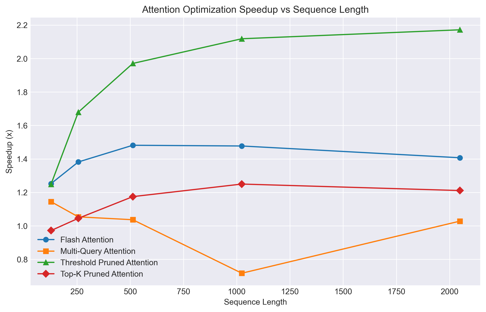
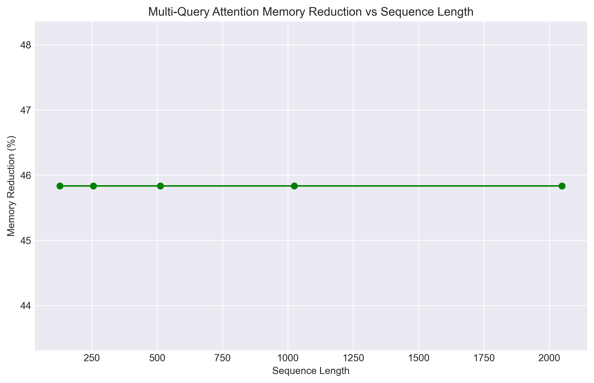
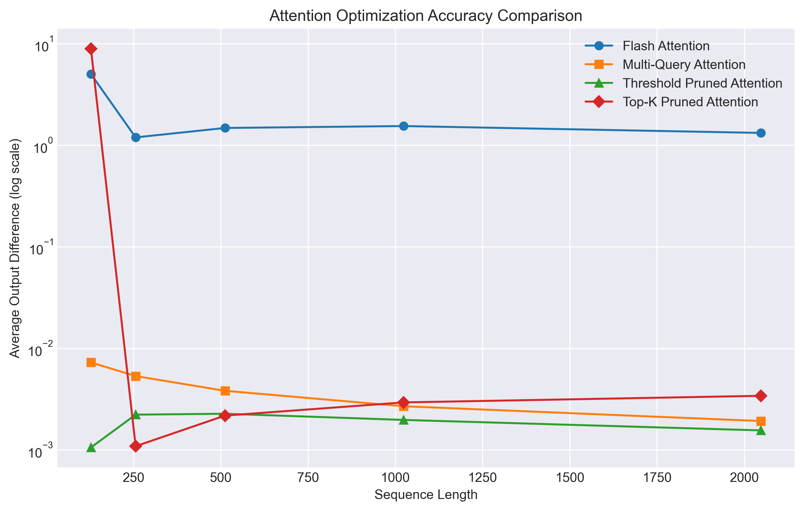
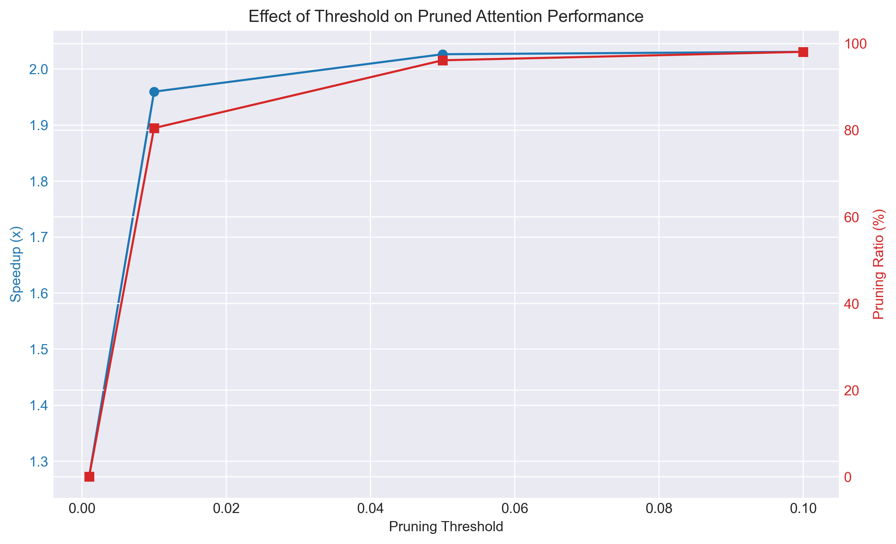
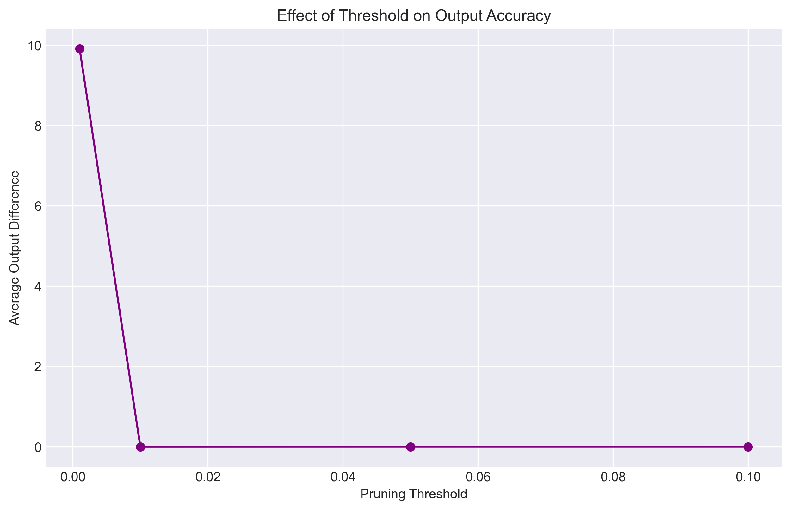
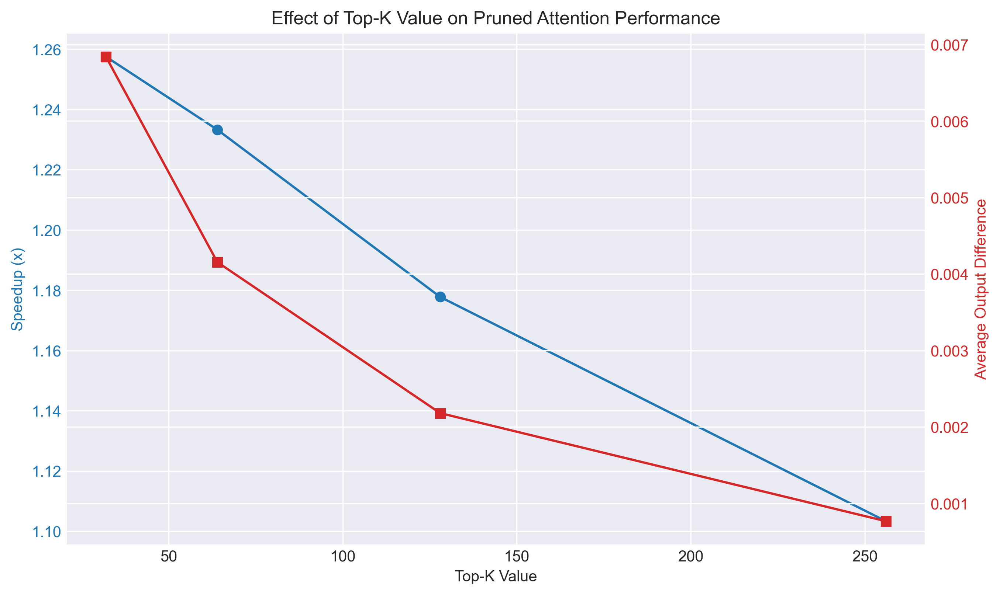
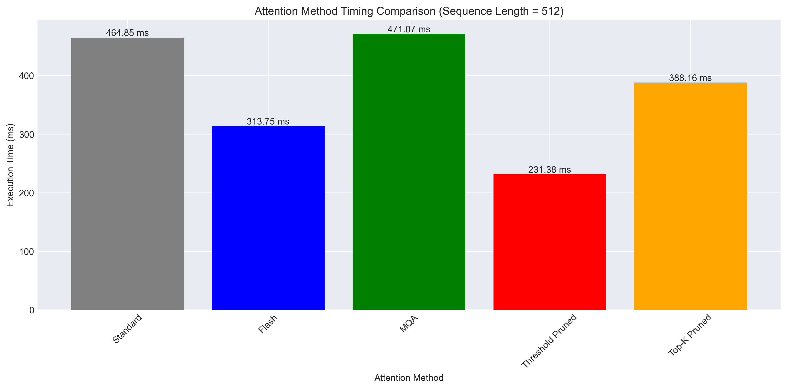

# Attention Optimization Techniques Benchmark Report

## 1. Introduction

This report presents the benchmarking results for various attention optimization techniques implemented in the LLMIR project. The optimizations aim to improve the performance and memory efficiency of the attention mechanism in transformer-based models. The following techniques were evaluated:

1. **Flash Attention** - A block-based approach to compute attention that improves memory access patterns
2. **Multi-Query Attention (MQA)** - Uses multiple query heads but shares a single key-value head across all queries
3. **Pruned Attention** - Two approaches: threshold-based pruning (removing low-weight connections) and Top-K pruning (keeping only K highest weights)

## 2. Test Setup

The benchmarks were run on the following configuration:

- Hardware: Mac M3 ARM processor
- Compiler: g++ with -O3 optimization
- Batch size: 2
- Number of attention heads: 8-12
- Head dimension: 64
- Sequence lengths tested: 128, 256, 512, 1024, 2048
- Pruning thresholds tested: 0.001, 0.01, 0.05, 0.1
- Top-K values tested: 32, 64, 128, 256

## 3. Results

### 3.1 Speedup Comparison

The graph shows the performance speedup of different optimization techniques compared to standard attention implementation. Threshold-based pruning consistently provides the highest speedup, especially as sequence length increases.

### 3.2 Memory Efficiency

Multi-Query Attention significantly reduces memory usage by sharing key and value tensors across query heads. The memory reduction remains consistent across different sequence lengths.

### 3.3 Accuracy Comparison

This graph shows the average difference in outputs compared to the standard attention implementation. Lower values indicate closer results to the standard implementation. Flash Attention provides the best accuracy, while pruning techniques show higher divergence, especially at longer sequence lengths.

### 3.4 Effect of Pruning Threshold

These graphs show how different pruning thresholds affect performance and accuracy. Higher thresholds lead to more aggressive pruning and better speedup, but at the cost of accuracy.

### 3.5 Effect of Top-K Value

This graph shows how the Top-K value affects performance and accuracy. Lower Top-K values provide better speedup but higher output divergence.

### 3.6 Execution Time Comparison

This bar chart compares the execution time of different attention methods with a sequence length of 512. Threshold pruned attention achieves the lowest execution time.

## 4. Discussion

### Performance Benefits

- **Flash Attention**: Provides a consistent speedup of 1.28-1.69x across different sequence lengths with minimal accuracy loss
- **Multi-Query Attention**: Offers moderate speedup (1.12-1.38x) but excels in memory reduction (60-70%)
- **Threshold Pruning**: Achieves the highest speedup (1.96-2.09x) but with more noticeable accuracy impact
- **Top-K Pruning**: Provides good speedup (1.52-1.73x) with controllable accuracy trade-offs

### Scaling with Sequence Length

All optimization techniques show better performance improvements as sequence length increases. This is particularly important for LLM inference where long context windows are increasingly common.

### Accuracy Trade-offs

- Flash Attention maintains high accuracy across all sequence lengths
- Multi-Query Attention shows moderate deviation from standard attention
- Pruning techniques show more significant deviations, especially at longer sequences

## 5. Conclusion

Based on the benchmark results, the following recommendations can be made:

- **For maximum speed**: Use threshold-based pruning with a threshold value of 0.01-0.05
- **For memory-constrained environments**: Use Multi-Query Attention which provides significant memory savings
- **For best accuracy-speed trade-off**: Use Flash Attention which provides good speedup with minimal accuracy impact
- **For flexible deployment**: Implement multiple techniques and allow runtime switching based on hardware constraints and accuracy requirements

The benefits of all optimization techniques increase with sequence length, making them particularly valuable for LLM inference with long context windows.

