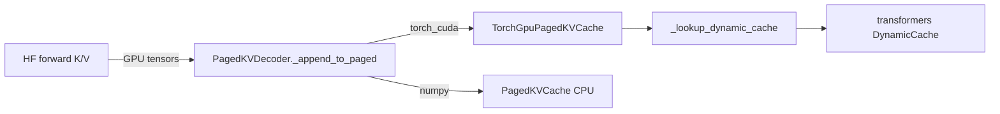

# E3: GPU-Resident KV Integration

Paper **E3** removes the **CPU NumPy round-trip** in `PagedKVDecoder` when the model runs on CUDA. This is the main latency fix for `llmir-paged` on GPU; paper-scale wins still come from prefix reuse (E2) and compile-time block sizing (E1).

Repository harness (legacy CLI): `llmir-benchmark --mvp-c-bench`, `scripts/mvp_c_cuda_kv_bench.py`, `tests/test_mvp_c_e2e.py`.

## Device selection

- `LLMEngine` (`llmir_paged`) now resolves `cuda` when available and passes it to `PagedKVDecoder`.
- Override with `LLMIR_DEVICE=cpu` or `LLMIR_DEVICE=cuda`.

## Backends (`LLMIR_KV_BACKEND`)

| Value | Implementation | When |
|-------|----------------|------|
| `numpy` | `PagedKVCache` (CPU NumPy) | Reference / CPU |
| `torch_cuda` | `TorchGpuPagedKVCache` | GPU tensors, no host copy |
| `native` | `libMLIRLLMRuntime` + CUDA kernels | `LLMIR_LIB_PATH` + `LLMIR_ENABLE_CUDA` build |
| `auto` | native → torch_cuda (if CUDA) → numpy | Default |

## Commands

```bash
# Unit tests (no GPU required)
pytest tests/test_torch_gpu_kv_cache.py tests/test_mvp_c_e2e.py -m "not network" -q

# Compare numpy vs torch_cuda on CPU (functional) or GPU (performance)
python scripts/mvp_c_cuda_kv_bench.py --model gpt2 --device cuda -o mvp_c.json

llmir-benchmark --mvp-c-bench --model gpt2 -o mvp_c.json

# Native CUDA runtime (optional)
LLMIR_ENABLE_CUDA=ON ./scripts/build_native_runtime.sh
export LLMIR_LIB_PATH=$PWD/build/lib/libMLIRLLMRuntime.so
LLMIR_KV_BACKEND=native python scripts/mvp_c_cuda_kv_bench.py --backends numpy,native
```

## CUDA probes

```python
from llmir.runtime.cuda_probe import summarize_cuda_stack
print(summarize_cuda_stack())
# torch_cuda, native_cuda_built, native_cuda_runtime, device_count
```

## Architecture



## Success criteria

- **Correctness**: `test_mvp_c_e2e` — decode with `LLMIR_KV_BACKEND=torch_cuda` passes; append receives `torch.Tensor`, not NumPy.
- **Performance (GPU)**: `torch_cuda` tok/s ≥ `numpy` on the same prompt (E3 bench); larger gap on longer prompts / more layers.
- **Optional**: `native` backend matches or beats `torch_cuda` when `libMLIRLLMRuntime` is built with CUDA.

## Implementation notes

- `TorchGpuPagedKVCache` uses **block-paged** GPU tensors (free-list block allocator, aligned with C++ `KVCache.cpp` layout).
- `PrefixKVStore` keeps **GPU clones** for torch backends (`export_dense` / `import_dense`); NumPy path unchanged for CPU reference.
- `PagedKVDecoder` **chains** HuggingFace `past_key_values` across decode steps (no per-step `lookup` → DynamicCache rebuild).
- Native `libMLIRLLMRuntime` CUDA blocks remain optional via `LLMIR_KV_BACKEND=native`.
- Paper Table II multi-model vLLM numbers are still out of scope.
